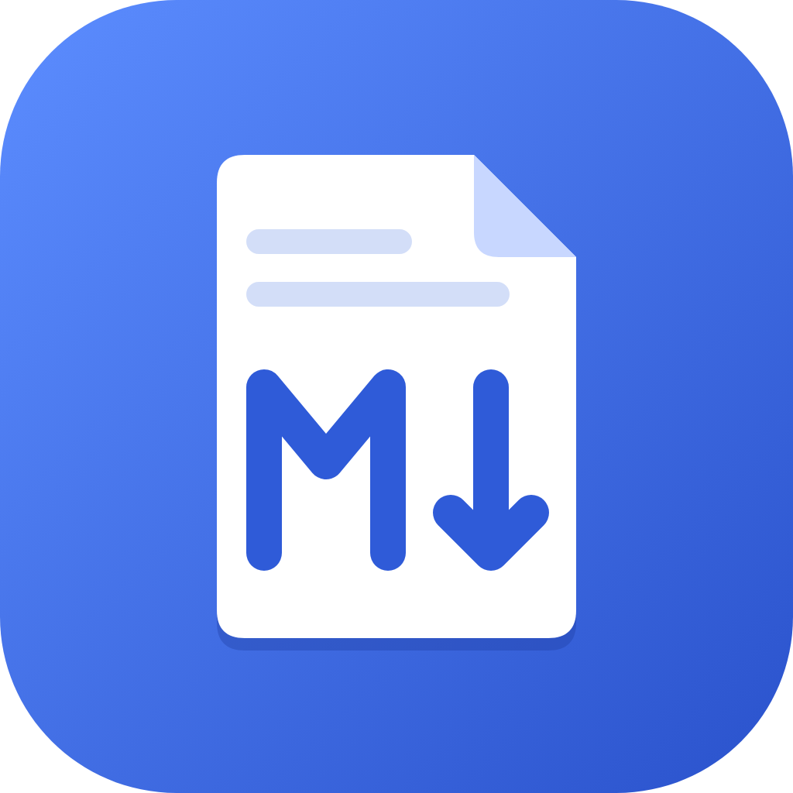

<p align="center"></p>

# MD Viewer

一個用 Flutter 寫的 Markdown 閱讀器，支援 macOS、Windows、iOS、Android。由 **Easier Life 簡單點生活** 出品。

## 版面配置

版面依 **視窗寬度** 決定（`lib/layout/breakpoints.dart`），旋轉、調整視窗大小或進入 iPad 分割畫面時會即時切換，並保留閱讀位置。

| 模式 | 條件 | 畫面 |
| --- | --- | --- |
| `mobile` | 寬 < 600（且不是寬 ≥ 480 的橫向） | 上方 AppBar、左側滑出檔案清單、底部大綱 |
| `medium` | 寬 ≥ 600，或橫向且寬 ≥ 480 | 電腦版：工具列＋可拖曳寬度的側邊欄＋內文，大綱從右側滑出 |
| `wide` | 寬 ≥ 1000 | 電腦版：側邊欄＋內文＋固定在右側的大綱 |

- 手機直向 → `mobile`；手機轉橫向 → `medium`（電腦版）
- 平板直向／橫向都夠寬 → 直接是電腦版
- 電腦視窗拉窄到 600 以下 → 也會變成手機版

## 功能

- GitHub 風格 Markdown：表格、任務清單、刪除線、自動連結、`> [!NOTE]` 提示區塊
- 程式碼高亮、語言標籤、一鍵複製
- 圖片：網路圖、相對路徑、data URI、SVG（含 shields.io 徽章）；點圖可放大
- 常見 README HTML：`<p align="center">`、``、`<br>`、`<details>`、`<kbd>`，HTML 註解會隱藏
- YAML front matter 顯示成程式碼區塊
- 大綱：點擊跳轉、捲動時自動標示目前章節
- 文件內錨點 `[x](#標題)`、相對連結到其他 `.md`（可帶 `#錨點`）
- 淺色／深色／跟隨系統、文字大小 80%–160%
- 記住最近開啟的檔案，重開 App 會回到上次的文件
- 電腦版：開啟資料夾（側邊欄樹狀列出所有 `.md`）、拖曳檔案或資料夾、外部編輯存檔後自動重新載入、鍵盤快捷鍵（⌘/Ctrl + O、⇧O、R、B、+、-、0、,）
- 系統「打開方式」：macOS Finder、iOS「檔案」分享、Android「開啟方式」、Windows（MSIX 安裝版會關聯 `.md`）

## 開發

```bash
flutter pub get
flutter test
flutter run -d macos      # 或 windows / iPhone 模擬器 / Android 裝置
```

把測試用的 `.md` 放進 iOS 模擬器（出現在「檔案」App › 我的 iPhone）：

```bash
tool/sim_add_files.sh 你的檔案.md
```

自己編譯的版本就是完整的閱讀器：沒有廣告也沒有內購——程式不會初始化廣告 SDK，也不會查詢任何商店。官方在各商店上架的版本另外啟用了廣告與一次性的「支持者」購買（程式碼在 `lib/monetization/`，預設關閉）。

隱私權政策見 [PRIVACY.md](PRIVACY.md)。

## 專案結構

```
lib/
  main.dart                 啟動、接收系統傳入的檔案
  app.dart                  MaterialApp、主題、語系
  layout/breakpoints.dart   手機／電腦版的寬度判斷
  state/                    AppState（檔案、設定、最近開啟）、ViewerController（跳轉、目前章節）
  services/                 檔案讀取／選擇／監看、資料夾掃描、原生 channel
  models/md_document.dart   文件、標題解析（GitHub slug）
  markdown/                 樣式、程式碼區塊、圖片、HTML 轉換、提示區塊
  ui/                       HomePage、DesktopShell、MobileShell、閱讀器、大綱、側邊欄
  monetization/             商店版才啟用的廣告與內購（預設關閉）
```

## 平台備註

- **macOS**：開啟 App Sandbox（Mac App Store 要求）。使用者開過的檔案與資料夾會存成 security-scoped bookmark，重開後仍可讀取。只開單一檔案時，同資料夾的圖片需要授權資料夾才看得到——App 會顯示「授權資料夾」提示；用「開啟資料夾」開的文件不受影響。
- **iOS / Android**：開啟的檔案會複製一份到 App 內（「我的檔案」），之後不需要原始檔也能再開。因為只複製單一檔案，文件內的 **相對路徑圖片與連結在手機上無法使用**（網路圖片正常）。
- **Windows**：用命令列參數開檔；MSIX 安裝版會註冊 `.md` 等副檔名的「開啟方式」。

## Logo 與 App 圖示

Logo 定義在 `tool/generate_icons.dart`（SVG），修改後重新產生各平台圖示：

```bash
flutter test tool/generate_icons.dart
dart run flutter_launcher_icons
```

## 授權

程式碼以 [Apache License 2.0](LICENSE) 開源，第三方套件授權可在 App 的「設定 › 開源授權」查看。

「MD Viewer」名稱與 Logo 不在授權範圍內，發佈修改版請換成自己的名稱與圖示，詳見 [TRADEMARKS.md](TRADEMARKS.md)。貢獻方式見 [CONTRIBUTING.md](CONTRIBUTING.md)。
